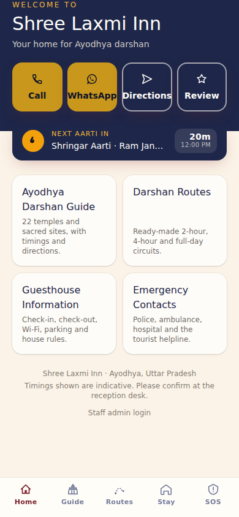
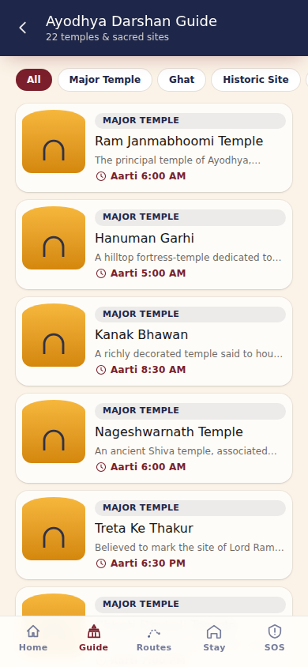
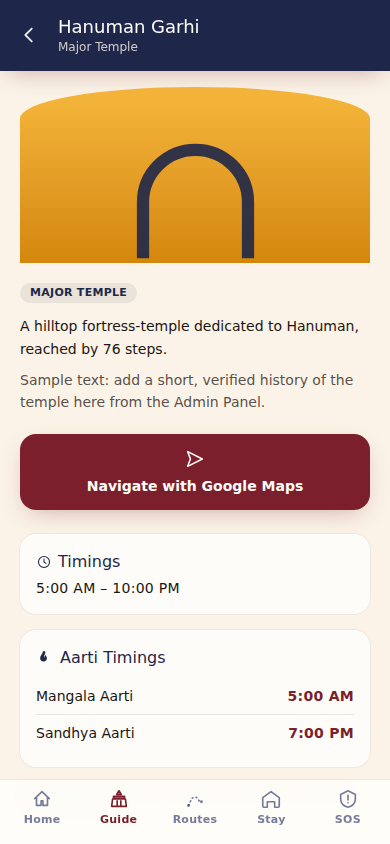
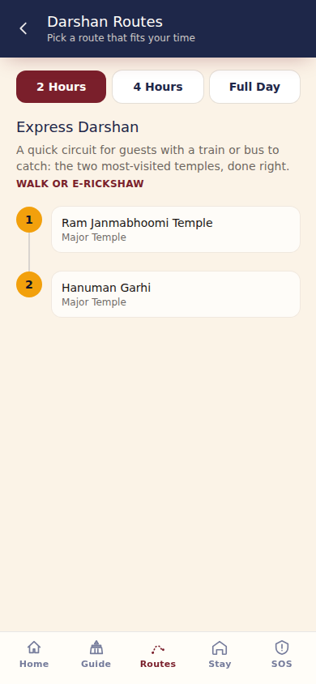
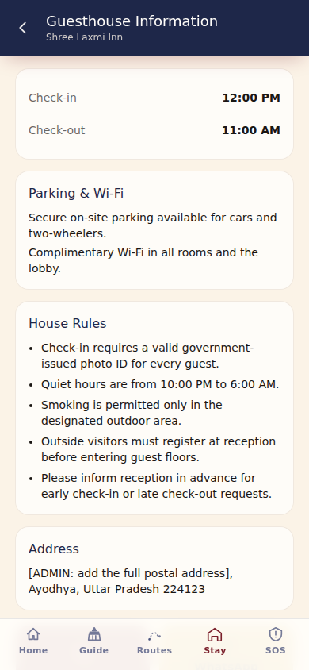
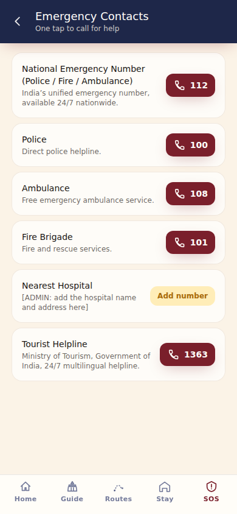
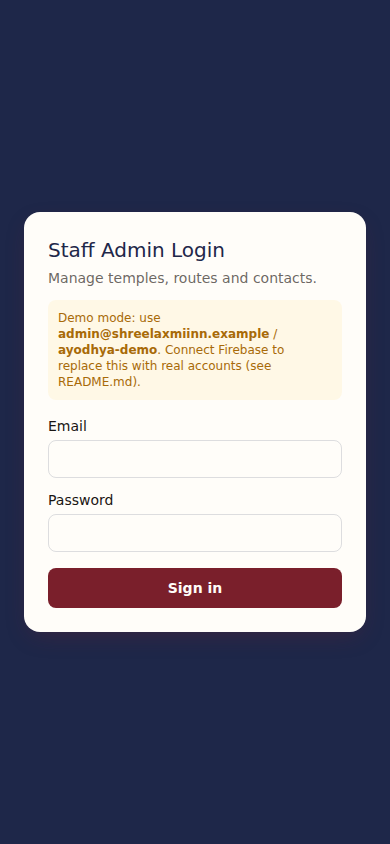

# Shree Laxmi Inn — Ayodhya Darshan Guide PWA

[](https://github.com/MrBoyard7/shree-laxmi-inn-pwa/actions/workflows/ci.yml)
[](https://codecov.io/gh/MrBoyard7/shree-laxmi-inn-pwa)
[](LICENSE)
[](package.json)
[](https://react.dev)
[](https://vite.dev)
[](https://firebase.google.com)
[](https://web.dev/progressive-web-apps/)
[](https://prettier.io)

A QR-based Progressive Web App for **Shree Laxmi Inn**, a guesthouse in Ayodhya. A guest scans a QR code at check-in and, with no app install, gets a mobile-first guide to Ayodhya's temples, ready-made darshan routes, guesthouse information, and one-tap calls to reception or emergency services. A lightweight Admin Panel lets guesthouse staff keep everything up to date.

> **Portfolio project.** This is an independently-built sample project demonstrating a full PWA build (React + Firebase + Google Maps deep links + an Admin Panel), not a commissioned deliverable for a specific client. Every piece of temple, timing and contact data shipped in this repository is **sample/seed content** — see [Content accuracy & safety](#content-accuracy--safety) before using it with real guests.

## Preview

| Home                                      | Darshan Guide                                             | Temple Detail                                             |
| ----------------------------------------- | --------------------------------------------------------- | --------------------------------------------------------- |
|  |  |  |

| Darshan Routes                                         | Guesthouse Info                                          | Emergency Contacts                                             |
| ------------------------------------------------------ | -------------------------------------------------------- | -------------------------------------------------------------- |
|  |  |  |

## Features

**Guest-facing app**

- Opens straight in the mobile browser from a QR code — no app store, no install step (installable as a PWA if the guest chooses to)
- Home screen with guesthouse branding and one-tap Call, WhatsApp, Directions and Google Review buttons
- A live "Next Aarti" countdown ribbon, pulled from every temple's aarti schedule
- Ayodhya Darshan Guide: 22 temples and sacred sites, filterable by category, each with photos, history, timings, aarti schedule and a Google Maps navigation button
- Darshan Routes: 2-hour, 4-hour and full-day circuits with ordered stops
- Guesthouse Information: check-in/check-out, parking, Wi-Fi, house rules, address
- Emergency Contacts with one-tap calling: national Police/Fire/Ambulance numbers, tourist helpline, and a slot for the local hospital
- Fully responsive, installable, and works offline for previously-visited pages (service worker precaching via Workbox)

**Admin Panel** (`/admin`)



- Add / edit / delete temples, including photo upload
- Update opening hours and aarti timings
- Reorder and edit the three darshan routes
- Edit guesthouse information and emergency contacts
- Works immediately in a local **demo mode** (see below) or against your own Firebase project

## Tech stack

| Layer                    | Choice                              | Why                                                                 |
| ------------------------ | ----------------------------------- | ------------------------------------------------------------------- |
| UI                       | React 19 + Vite 8                   | Fast dev server, small production build, current React              |
| Styling                  | Tailwind CSS v4                     | Utility-first, CSS-first theme tokens, no separate config file      |
| Routing                  | React Router v7                     | Standard client-side routing, nested layouts for the Admin Panel    |
| Data & Auth              | Firebase (Firestore, Auth, Storage) | Real-time sync for admin edits, managed auth, photo storage         |
| Maps                     | Google Maps deep links              | No API key or billing needed for "open directions" / "search" links |
| Offline / installability | `vite-plugin-pwa` (Workbox)         | Manifest + service worker generation, offline caching               |
| Testing                  | Vitest + RTL + user-event           | Fast, Vite-native unit/component tests with realistic interactions  |
| Linting / formatting     | ESLint 9 (flat config) + Prettier   | Consistent code style, React Hooks rules enforced                   |
| CI                       | GitHub Actions + Codecov            | Lint, format check, tests with coverage, and build on every push/PR |

## Project structure

```text
shree-laxmi-inn-pwa/
├── .github/
│   └── workflows/
│       └── ci.yml                    # Lint, format check, test+coverage, build
├── docs/
│   └── screenshots/                   # Screenshots used in this README
├── public/
│   ├── favicon.svg
│   └── icons/                         # Generated PWA icon set (see scripts/generate_icons.py)
├── scripts/
│   └── generate_icons.py              # Regenerates the app icon set from the brand mark
├── src/
│   ├── components/
│   │   ├── admin/
│   │   │   ├── AdminLayout.jsx
│   │   │   ├── ProtectedRoute.jsx
│   │   │   └── __tests__/             # 3 test files
│   │   ├── common/
│   │   │   ├── Misc.jsx
│   │   │   ├── QuickActionButton.jsx
│   │   │   ├── icons.jsx
│   │   │   └── __tests__/             # 2 test files
│   │   ├── layout/
│   │   │   ├── AppLayout.jsx
│   │   │   ├── BottomNav.jsx
│   │   │   ├── Footer.jsx
│   │   │   ├── PageHeader.jsx
│   │   │   └── __tests__/             # 3 test files
│   │   └── temple/
│   │       ├── NextAartiRibbon.jsx
│   │       ├── TempleCard.jsx
│   │       └── __tests__/             # 2 test files
│   ├── context/
│   │   ├── AuthContext.jsx            # Firebase Auth (or local demo login)
│   │   ├── DataContext.jsx            # Live temples/routes/guesthouse/contacts
│   │   └── __tests__/                 # 2 test files
│   ├── data/
│   │   ├── temples.seed.js            # 22 sample Ayodhya temples & sites
│   │   ├── routes.seed.js             # 2h / 4h / full-day sample routes
│   │   └── guesthouse.seed.js         # Sample guesthouse info & emergency contacts
│   ├── firebase/
│   │   └── config.js                  # Firebase init, guarded by env vars
│   ├── pages/
│   │   ├── admin/
│   │   │   ├── AdminDashboard.jsx
│   │   │   ├── AdminLogin.jsx
│   │   │   ├── ContactsEditor.jsx
│   │   │   ├── GuesthouseEditor.jsx
│   │   │   ├── RoutesEditor.jsx
│   │   │   ├── TempleEditor.jsx
│   │   │   └── __tests__/             # 6 test files
│   │   ├── Home.jsx
│   │   ├── DarshanGuide.jsx
│   │   ├── TempleDetail.jsx
│   │   ├── DarshanRoutes.jsx
│   │   ├── GuesthouseInfo.jsx
│   │   ├── EmergencyContacts.jsx
│   │   ├── NotFound.jsx
│   │   └── __tests__/                 # 7 test files
│   ├── services/
│   │   ├── dataService.js             # Firestore ⇄ local-demo-store switch
│   │   ├── localStore.js              # localStorage-backed demo data layer
│   │   ├── photoUpload.js             # Firebase Storage ⇄ base64 demo upload
│   │   └── __tests__/                 # 5 test files (local mode + Firebase mocked)
│   ├── test/
│   │   └── setup.js                   # jest-dom matchers, loaded by Vitest
│   ├── utils/
│   │   ├── links.js                   # tel: / wa.me / Google Maps link builders
│   │   ├── time.js                    # 12h formatting + "next aarti" calculation
│   │   └── __tests__/                 # 2 test files
│   ├── App.jsx                        # Route table (Admin Panel is lazy-loaded)
│   ├── main.jsx
│   └── index.css                      # Tailwind v4 theme tokens & base styles
├── .env.example
├── eslint.config.js
├── vite.config.js
├── LICENSE
└── package.json
```

32 test files, 141 tests in total — see [Testing](#testing) below for coverage numbers.

## Getting started

### Prerequisites

- Node.js 18.18 or newer ([nodejs.org](https://nodejs.org))
- npm 10+ (bundled with Node.js)

### Install and run

```bash
git clone https://github.com/MrBoyard7/shree-laxmi-inn-pwa.git
cd shree-laxmi-inn-pwa
npm install
npm run dev
```

Open the printed local URL (typically `http://localhost:5173`) in your browser, or on your phone via your computer's local network IP, to try it on a real mobile screen.

No Firebase project is required to try the app: with no `.env` file present, it automatically runs in **local demo mode**, using the sample data in `src/data/*.seed.js` and a `localStorage`-backed data layer (see [`src/services/localStore.js`](src/services/localStore.js)). The Admin Panel is fully usable in this mode — see [Admin Panel access](#admin-panel-access) below.

### Available scripts

| Command                  | What it does                                                           |
| ------------------------ | ---------------------------------------------------------------------- |
| `npm run dev`            | Start the Vite dev server with hot reload                              |
| `npm run build`          | Production build to `dist/` (also generates the service worker)        |
| `npm run preview`        | Serve the production build locally, for a final check before deploying |
| `npm run lint`           | Run ESLint across the project                                          |
| `npm run format`         | Format the project with Prettier                                       |
| `npm run format:check`   | Check formatting without writing changes (used in CI)                  |
| `npm run test`           | Run the unit/component test suite once                                 |
| `npm run test:watch`     | Run tests in watch mode while developing                               |
| `npm run test:coverage`  | Run tests and print a coverage report                                  |
| `npm run generate-icons` | Regenerate `public/icons/*.png` from `scripts/generate_icons.py`       |

### How to verify everything works

```bash
npm install
npm run lint             # → 0 errors
npm run format:check      # → "All matched files use Prettier code style!"
npm run test:coverage     # → all tests passing, with a coverage table printed
npm run build             # → dist/ produced, plus dist/sw.js and dist/manifest.webmanifest
npm run preview           # → open the printed URL to click through the built app
```

## Testing

The suite covers every page, every Admin Panel screen, both data backends (local demo store and Firebase, with Firebase mocked), and the small utility modules — 140+ tests in total.

```bash
npm run test:coverage
```

Latest run:

| Metric     | Coverage   |
| ---------- | ---------- |
| Statements | **96.6 %** |
| Branch     | **93.2 %** |
| Functions  | **94.9 %** |
| Lines      | **98.6 %** |

The Codecov badge at the top of this file tracks this number on every push. HTML and lcov reports are also written to `coverage/` (gitignored) for local inspection.

## Admin Panel access

Go to **Staff admin login** at the bottom of any page, or visit `/admin/login` directly.

- **Local demo mode** (no `.env` present): sign in with the credentials shown right on the login screen (`admin@shreelaxmiinn.example` / `ayodhya-demo` by default — see `VITE_DEMO_ADMIN_EMAIL` / `VITE_DEMO_ADMIN_PASSWORD` in `.env.example`). Edits are saved to your browser's `localStorage`, so they persist on reload but are local to that browser only.
- **With Firebase connected** (see below): sign in with a real user created in Firebase Authentication. Edits sync live to Firestore for every device.

## Connect your own Firebase project

1. Create a project at [console.firebase.google.com](https://console.firebase.google.com).
2. Add a **Web app** to the project and copy the config values.
3. Enable **Firestore Database**, **Authentication → Email/Password**, and **Storage**.
4. Create at least one user under Authentication for yourself/your staff.
5. Copy `.env.example` to `.env` and fill in the six `VITE_FIREBASE_*` values.
6. Restart `npm run dev`. The console message about "local demo data mode" will disappear, and the Admin Panel will use real Firebase Auth and Firestore.
7. Recommended: lock down Firestore/Storage security rules so only authenticated users can write, while public read access stays open for the guest-facing pages.

## Deployment

The app is a static build (`npm run build` → `dist/`), so it can be hosted on any static host that serves `dist/` and rewrites unknown routes to `index.html` for client-side routing (Firebase Hosting, Netlify, Vercel, or your own domain via Nginx/Apache).

To use your own domain:

1. Run `npm run build`.
2. Upload the contents of `dist/` to your web server or hosting provider.
3. Configure a catch-all rewrite to `index.html` (needed for `/darshan-guide/:templeId` style routes to work on refresh).
4. Point your domain's DNS at the host, and ensure HTTPS is enabled — service workers and "Add to Home Screen" both require HTTPS (or `localhost` for local testing).
5. Generate a QR code that points at your domain and print/place it in guest rooms and common areas.

## Content accuracy & safety

This repository ships with **sample data**, not verified, production-ready content:

- Temple names and categories are real, well-known Ayodhya sites, but each entry's history text, timings and aarti schedule are placeholders and **must be verified and updated from the Admin Panel** before the app is shown to real guests.
- The guesthouse address, reception phone/WhatsApp number, and Google Review link are placeholders — fill these in via the Admin Panel or `src/data/guesthouse.seed.js`.
- Emergency contacts ship with India's real, nationwide numbers (112, 100, 101, 108, and the 1363 tourist helpline), which are safe to keep as-is. The **local hospital entry is a placeholder** and must be filled in with a verified number — the app clearly labels it "Add number" until you do.

## Known trade-offs

- The production bundle is a single ~250 KB (gzipped) chunk for the guest-facing app, mostly the Firebase SDK; the Admin Panel is already code-split separately via `React.lazy`. This is a reasonable size for a Firebase-backed PWA, not a bug.
- Local demo mode's photo upload stores small images as base64 in `localStorage` (capped at 1.5 MB per photo) purely so the Admin Panel is usable without any setup. Connect Firebase Storage for real, unlimited photo hosting.
- Route stop reordering and category filtering are intentionally simple (button/select based) rather than drag-and-drop, to keep the codebase dependency-light.

## Contributing

Contributions, issues and suggestions are welcome — see [CONTRIBUTING.md](CONTRIBUTING.md).

## License

Released under the [MIT License](LICENSE).

Copyright (c) 2026 Prince Boyard MBOUNGOU NGOMA